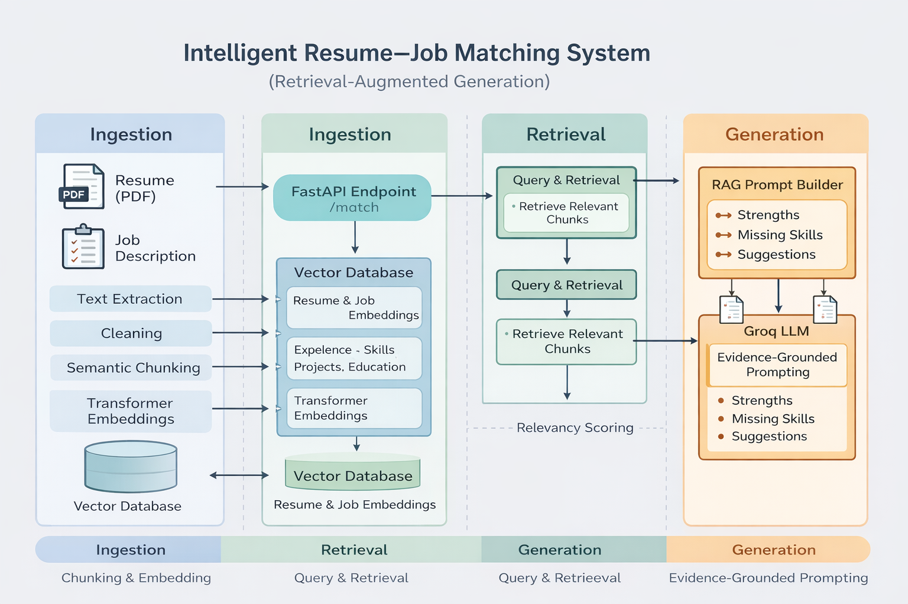

# Intelligent Resume–Job Matching & Skill Gap Analysis (RAG-Powered)

## 🔗 Live Links

Frontend (Streamlit UI): Coming Soon  
Backend API (FastAPI): Coming Soon  

An end-to-end Retrieval-Augmented Generation (RAG) system that semantically matches resumes to job descriptions, explains fit or mismatch, identifies missing skills, and grounds all LLM outputs in retrieved evidence.

---

## 🔹 Key Features

- Semantic resume & job description ingestion  
- Section-aware chunking (experience, skills, projects, education)  
- Transformer-based embeddings  
- Vector search with Qdrant  
- Evidence-grounded RAG prompting with citations  
- Hallucination guardrails  
- FastAPI backend  
- Streamlit UI  

---

## 🔹 Architecture Overview



                   ┌─────────────────────┐
                   │  Resume PDF / Text  │
                   └──────────┬──────────┘
                              │
                   ┌──────────▼──────────┐
                   │   Text Extraction   │
                   │ (PDF -> clean text) │
                   └──────────┬──────────┘
                              │
                   ┌──────────▼──────────┐
                   │ Section Segmenter    │
                   │ (Experience, Skills,│
                   │ Education, Projects)│
                   └──────────┬──────────┘
                              │
                   ┌──────────▼──────────┐
                   │ Semantic Chunker     │
                   │ (section-based)     │
                   └──────────┬──────────┘
                              │
                   ┌──────────▼──────────┐
                   │ Embedding Generator  │
                   │ (Transformer model) │
                   └──────────┬──────────┘
                              │
                   ┌──────────▼──────────┐
                   │ Vector Database      │
                   │ (Resume Index)       │
                   └─────────────────────┘


                   ┌─────────────────────┐
                   │ Job Description     │
                   └──────────┬──────────┘
                              │
                   ┌──────────▼──────────┐
                   │ Section Segmenter    │
                   └──────────┬──────────┘
                              │
                   ┌──────────▼──────────┐
                   │ Semantic Chunker     │
                   └──────────┬──────────┘
                              │
                   ┌──────────▼──────────┐
                   │ Embedding Generator  │
                   └──────────┬──────────┘
                              │
                   ┌──────────▼──────────┐
                   │ Vector Database      │
                   │ (JD Index)           │
                   └─────────────────────┘


================== MATCHING PIPELINE ==================

 User Request: "Evaluate Resume vs JD"

            ┌──────────────────────────┐
            │ JD → Query Embeddings     │
            └──────────┬───────────────┘
                       │
            ┌──────────▼──────────┐
            │ Resume Vector Search │
            └──────────┬──────────┘
                       │
            ┌──────────▼──────────┐
            │ JD Vector Search     │
            └──────────┬──────────┘
                       │
            ┌──────────▼──────────┐
            │ Optional Reranker    │
            └──────────┬──────────┘
                       │
            ┌──────────▼──────────┐
            │ Evidence Assembler   │
            └──────────┬──────────┘
                       │
            ┌──────────▼──────────┐
            │ RAG Prompt Builder   │
            └──────────┬──────────┘
                       │
            ┌──────────▼──────────┐
            │ LLM (restricted)     │
            └──────────┬──────────┘
                       │
            ┌──────────▼──────────┐
            │ Structured Output    │
            │ + Citations          │
            └─────────────────────┘

---

## 🔹 Tech Stack

- Python  
- Sentence-Transformers  
- Qdrant  
- Groq LLM  
- FastAPI  
- Streamlit  

---

## 🔹 Setup Instructions

```bash
git clone <repo-url>
cd resume-job-matcher
python -m venv .venv
.venv\Scripts\activate
python -m pip install -r requirements.txt

```
---

## 🔹 Evaluation

- Retrieval quality measured using Recall@K and Precision@K  
- Faithfulness validated by checking all citations refer to retrieved evidence  
- LLM outputs forced to use evidence-only context  

This ensures reliable and explainable generation.


🔹 API Endpoint

- POST /match

- Inputs:

  Resume PDF

  Job description text

- Output:

  Match summary

  Strengths with evidence

  Missing skills with evidence

  Improvement suggestions

---

🔹 Why RAG?

Traditional keyword matching fails to capture semantic meaning.
This system retrieves relevant evidence before LLM reasoning, ensuring grounded, explainable, and trustworthy outputs.

---

🔹 Future Work

- Cross-encoder reranking

- Persistent vector database

- Evaluation dashboards

- Authentication & user accounts

---


